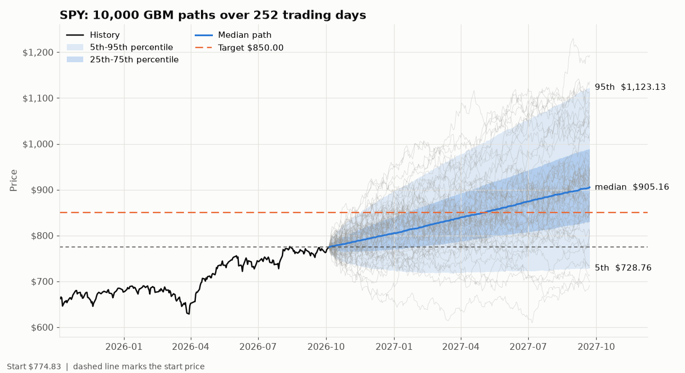
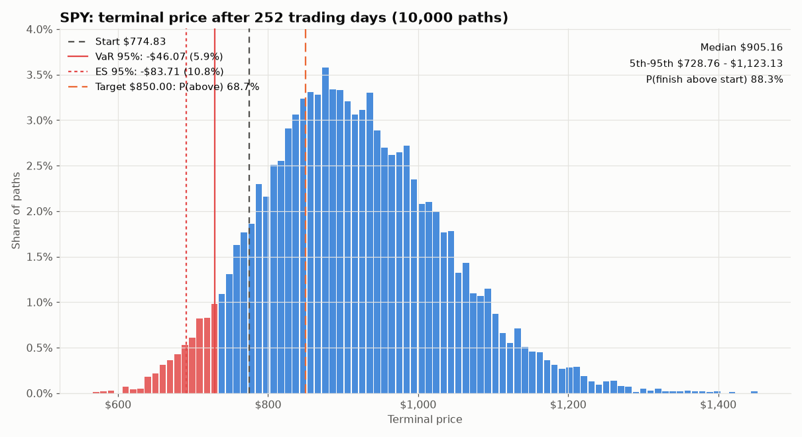
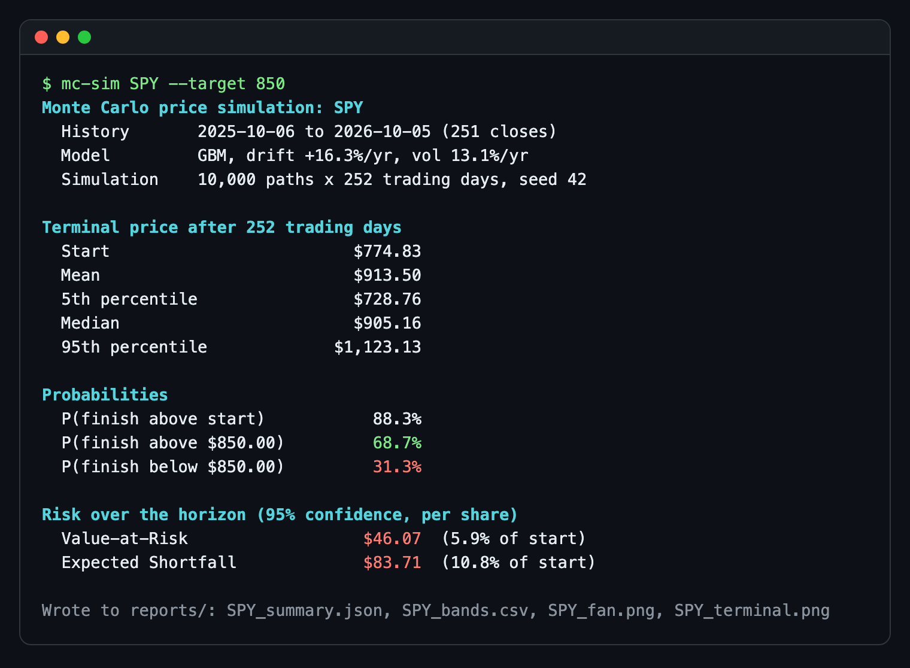

# Monte Carlo Price Simulator

`mc-sim` estimates drift and volatility from a stock's daily log returns, simulates thousands
of future price paths with geometric Brownian motion, and reports what a risk desk asks first:
the 5th/50th/95th percentile range, the probability of finishing above or below a target, and
Value-at-Risk and Expected Shortfall over the horizon. The simulation is a single vectorized
numpy computation with a seeded generator, so 10,000 one-year paths take well under a second
and every run is reproducible. It reads prices from Yahoo Finance or from a local CSV, so it
also runs offline and in CI.







## Features

- GBM with drift and volatility estimated from daily log returns, or overridden (`--drift 0` for a zero-drift risk view)
- Vectorized path generation: one normal draw, one cumulative sum, one `exp`; no Python loops
- Seeded `numpy.random.Generator` for reproducible runs (`--seed`)
- Percentile bands (5/50/95) per day, written to CSV
- Probability of finishing above the start price and above or below a `--target`
- Value-at-Risk and Expected Shortfall at any `--confidence`, in dollars and percent of start
- Fan chart with history and percentile bands; terminal-price histogram with the VaR tail marked
- Offline input with `--csv`; a two-year SPY sample is bundled in `data/SPY.csv`
- JSON output (`--json`) for scripting

## Quick start

```bash
git clone https://github.com/jovanshernandez/monte-carlo-price-simulator.git
cd monte-carlo-price-simulator
python3 -m venv .venv
source .venv/bin/activate
pip install -e ".[dev]"
```

Run against live Yahoo Finance data:

```bash
mc-sim SPY --target 850
mc-sim NVDA --days 63 --paths 20000 --confidence 0.99
```

Run offline against the bundled sample:

```bash
mc-sim --csv data/SPY.csv --target 800
mc-sim --csv data/SPY.csv --drift 0 --vol 0.20 --json --no-plots
```

Each run writes to `reports/` (change with `--output-dir`):

| File | Contents |
| --- | --- |
| `<TICKER>_summary.json` | Model parameters, simulation settings and every risk statistic |
| `<TICKER>_bands.csv` | 5th, 50th and 95th percentile price for each simulated day |
| `<TICKER>_fan.png` | Fan chart |
| `<TICKER>_terminal.png` | Terminal-price histogram with VaR and ES |

`--csv` takes any file whose first column is a date and which has an `Adj Close`, `Close`,
`close` or `price` column. `--lookback-days` (default 365) selects how much history is used
to estimate the model. Run `mc-sim --help` for all options.

## How it works

**Model.** Geometric Brownian motion assumes log returns are independent and normally
distributed. With daily drift `mu` and volatility `sigma`, each simulated day multiplies the
price by `exp((mu - sigma^2/2) + sigma * Z)` with `Z ~ N(0, 1)`. The `-sigma^2/2` term is the
convexity adjustment: it makes the expected price grow at `mu` while the median grows more
slowly, which is why the reported median terminal price sits below the mean.

**Estimation.** `sigma` is the sample standard deviation of daily log returns and `mu` is
their mean plus `sigma^2/2`. Both are annualized with 252 trading days for display. A
one-year drift estimate is noisy (SPY's trailing year gives +16%), so `--drift 0` is the
usual choice when the question is risk rather than return.

**Simulation.** Draw a `(days, paths)` matrix of standard normals, turn it into log
increments, `cumsum` down the time axis and exponentiate. The whole run is a handful of array
operations, so cost scales with memory bandwidth rather than interpreter speed.

**Risk statistics.** Loss is `start - terminal` per share.

- *Value-at-Risk* at 95% is the 95th percentile of that loss: in 95% of simulated paths the
  loss over the horizon is no worse than this.
- *Expected Shortfall* (CVaR) is the average loss in the worst 5% of paths. It is always at
  least VaR and describes how bad the tail is, not only where it starts.
- *Target probabilities* are the share of paths finishing above or below the target. Under
  GBM these have a closed form, which the tests use to check the simulation.

**Limits.** GBM has constant volatility and no jumps or fat tails, so it understates crash
risk. Treat the output as a baseline to compare against, not a forecast.

## Testing

```bash
pytest -q
```

The suite never touches the network (a fixture blocks the Yahoo Finance loader) and covers:

- Determinism: same seed gives identical paths; values pinned against a hand-built computation
- Statistics: terminal log-return mean and standard deviation match `(mu - sigma^2/2)T` and
  `sigma*sqrt(T)`; the mean terminal price matches `S0*exp(mu*T)`; parameter estimation
  recovers known inputs
- Risk: ES >= VaR, both increase with confidence, VaR matches the lognormal quantile, target
  probability matches the closed form, VaR and ES on a hand-checked distribution
- CLI: end-to-end runs on synthetic and bundled CSVs, output files, JSON, drift/vol overrides

GitHub Actions runs the tests on Python 3.12 and 3.14 plus an offline CLI smoke run.

## Project layout

```text
monte_carlo_price_simulator/
  simulation.py   GBM parameters, estimation from log returns, vectorized path simulation
  risk.py         Percentile bands, target probabilities, VaR, Expected Shortfall, summary
  market_data.py  Yahoo Finance download and CSV loader
  plotting.py     Fan chart and terminal histogram (matplotlib, Agg backend)
  cli.py          mc-sim entry point, text report, JSON and CSV outputs
data/SPY.csv      Two years of SPY daily closes for offline runs and tests
docs/images/      Screenshots used in this README
tests/            pytest suite (no network)
```
